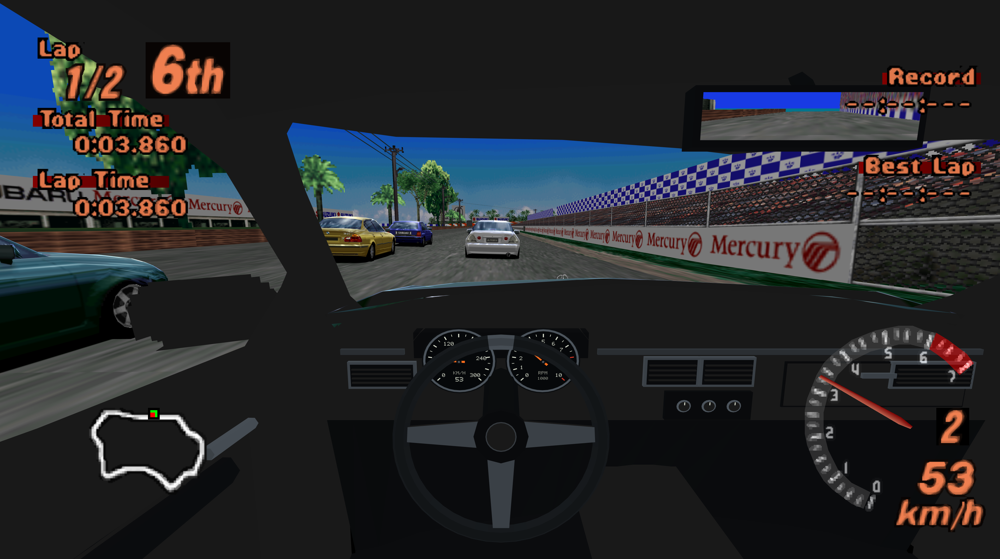

# Gran Turismo 2 PC & VR - 0.5.0

**0.5.0 adds cockpit driving.** A shared dashboard, seats and moving steering wheel fit inside each car's original body, retaining its hood, roof, pillars and window outlines. The cockpit includes adjustable seating and a rear-view mirror that can be resized or switched off. Open **F10 -> Cockpit / driver view**; see [cockpit controls and limits](docs/COCKPIT.md).

Windows PC / PCVR supports wheels, pedals, USB shifters and force feedback, with 72 embedded device profiles and guided setup. Driving assists include optional traction control, weak countersteering by default and an optional forward/reverse speed override. See [wheel setup](docs/WHEELS.md).

**Tested hardware:** Fanatec Gran Turismo DD Pro (8 Nm) with a Thrustmaster TH8A Shifter. This setup was used for wheel-driving tests and feedback on countersteering assistance. The other embedded device profiles have not all been tested on physical hardware.

**Play on a normal Windows PC without a headset, in PCVR, or directly on Quest 3. All three versions are included in one download: `GT2-0.5.0.zip`.**

| Version included | Where the game runs | Install | Launch |
|---|---|---|---|
| **Windows PC (flat / monitor)** | On your PC; no VR headset required | `INSTALL-PC.bat` | `PLAY.bat` |
| **Windows PCVR (OpenXR)** | On your PC, displayed in your connected headset | `INSTALL-PCVR.bat` | `PLAY-PCVR-STEAMVR.bat`, `PLAY-PCVR-META.bat` or `PLAY-PCVR-VD.bat` |
| **Quest 3 standalone VR** | On the headset; no streaming PC required to play | `INSTALL.bat` | **GT2 VR** under **Unknown Sources** |

The PLAY launchers are created in your installed game folder. The Quest APK inside the archive is named `GT2-VR-0.5.0.apk`; it is only the standalone component of the complete release.

This is a native C++ port with Vulkan rendering and ported game simulation. Arcade and Simulation are available in all three versions. See [CHANGELOG.md](CHANGELOG.md) for the release notes.

Supply your own supported disc images. Game data, BIOS and saves are not included. The screenshot above illustrates gameplay.

## Features

- A fitted cockpit for live single-player Driver view, with moving steering wheel and hands, speed/RPM needles, seat adjustments and a central rear-view mirror. Replays and split-screen retain their existing views. See [cockpit controls](docs/COCKPIT.md).
- Unified PC/Quest startup and a saved disc preference. Arcade and Simulation share graphics, HUD and control preferences while keeping separate memory cards. Desktop settings include HD media, intro visibility, all HUD switches, a profiler, gamepad bindings, DualSense pedals and both Arcade/Simulation cheats.
- Windows PCVR through OpenXR, with theatre menus/movies, stereo races, tracked head movement and Touch controls. See [PCVR setup](docs/PCVR.md).
- USB save transfer in both directions between PC and Quest, with card validation, backups and verified copying. Desktop and PCVR share PC saves. See [save transfer](docs/SAVE-TRANSFER.md).
- Arcade and Simulation discs, with a startup disc picker on PC and Quest, shared preferences and separate saves for each mode.
- Arcade races, rally/time trials, opponent AI, ghost/replay sessions; Simulation career, licences, dealerships, garage, tuning and events.
- Original fixed-step vehicle simulation, animated steering/suspension/wheels, car reflections, track scenery, particles and night lighting.
- Native audio: engine, tyres, road effects, music and movies. Race pause stops timers and the entire race audio mixer. VR/system suspension does not advance the race.
- Disc publisher/warning screens and Arcade intro, course previews and ending movies; button skipping. Optional playback of a locally prepared PlayStation startup; BIOS and captured startup media are **not bundled or required to play**.
- Saved graphics and control settings, graphics overlay, configurable draw distance including the entire course and distant scenery, MSAA and texture filtering.
- Original-resolution assets with higher-resolution rendering. PC supports fixed **720p, 1080p, 1440p and 4K**, or 50–200% of window size; configurable FPS cap/VSync and interpolated presentation. Physics stays at 30 Hz.
- Keyboard, XInput controllers and **native DualSense / DualSense Edge support on PC**, over USB or Bluetooth: buttons, sticks, trigger pedals, adjustable vibration and adaptive accelerator/brake resistance. Adaptive effects do not require Steam Input. Touch controllers have vibration, not adaptive triggers.
- Quest theatre-screen menus/movies and head-tracked stereo driving/replays. The HUD is projected per eye; the cockpit mirror sits on a physical surface inside the cabin.
- Three VR driving modes on PCVR and Quest: **Stick, Virtual wheel and Motion**. One/two-handed wheel grabbing with animated hands; all fingers stay closed while holding the wheel. Motion uses wrist rotation around the forearm, with grip-held steering and independent trigger pedals.
- VR Controls submenu: driving bindings, selected steering stick/motion hand, wheel position/size and height-only adjustment of the original starting flythrough. Automatic brake-to-reverse is available.
- VR Graphics submenu: 50–200% eye resolution, available headset refresh rates, MSAA, distance, textures, foveation and vibration. Resolution changes require a restart; other supported settings apply immediately.
- Saved km/h / mph selection in the VR HUD menu, with km/h as the default on both discs. Saved HUD visibility controls for map, lap/times, records, gauges, turbo, tyres, mirror, countdown, warnings, messages and replay caption.
- FPS profiler: application FPS, frame time, GPU time, 1% low, peak frame interval, texture-cache coverage and frustum-culling counts.
- Arcade cheats: unlock all course selections and the car roster as reversible overrides. Simulation VR cheats: gold licences, 99,999,999 credits, event unlocks and a car catalogue for adding cars to the garage. The original 100-car garage limit remains. Career cheat writes are checked and backed up before replacing a save.
- VR performance features: multiview stereo, both-eye frustum culling, decoded texture caching, staged uploads, direct MSAA rendering to compatible XR images, fixed peripheral foveation and CPU/GPU performance requests.
- Trees use position-based cylindrical billboards in VR: head rotation alone does not rotate them.
- Developer tools for car/track export, JSON modifications, captures and reference comparisons. Arbitrary new-track geometry compilation is not implemented.

## Install the 0.5.0 player release

Extract **GT2-0.5.0.zip** into a normal writable folder. Run **INSTALL.bat** for Quest, **INSTALL-PC.bat** for Windows desktop or **INSTALL-PCVR.bat** for Windows VR, then select one or both of your disc images. The package contains precompiled installation tools; no Visual Studio or C++ compilation is needed.

Start **PLAY-PCVR-META.bat** for Meta Quest Link / Air Link, **PLAY-PCVR-STEAMVR.bat** for SteamVR / Steam Link, or **PLAY-PCVR-VD.bat** for Virtual Desktop (VDXR), and **PLAY.bat** (also **gt2game.exe** directly) for desktop. All use one application: the optional PlayStation intro, then the same disc picker as Quest. **PLAY-PCVR.bat** retains automatic selection: running SteamVR, otherwise the system default. Runtime choices affect only the game process. The package includes the Khronos loader; the headset software must be installed separately. Use **TRANSFER_QUEST_SAVES_TO_PC.bat** or **TRANSFER_PC_SAVES_TO_QUEST.bat** to move saved cards after closing the game on both devices. Quest save exchange requires the 0.3.0 APK or newer.

On **Linux / Steam Deck**, extract the same ZIP, open a terminal in its folder and run `bash INSTALL-LINUX.sh`. It prepares discs and installs the standalone Quest game without Wine or modifying the SteamOS system partition. See the [Steam Deck step-by-step guide](docs/LINUX-INSTALL.md).

Windows installers prepare **HD pictures, fonts and HUD for both Arcade and Simulation by default**. Use `-HdMedia Original` to skip HD preparation, or `-HdMedia MenusAndMovies` to also prepare full-screen movies. Linux installs original media and can copy previously prepared HD packs.

Both Windows and Linux installers offer an **optional PlayStation startup**. Skip the BIOS prompt to play normally without it, or select your own matching 512 KiB BIOS dump to prepare the original white and dark screens with sound. Firmware is never downloaded or sent to Quest. Existing prepared intros can be disabled in the VR menu.

For Quest, enable developer mode, connect USB and accept USB debugging in the headset. The installer locates ADB or downloads a pinned Google Platform Tools archive, prepares the disc data, updates the APK, copies the assets and verifies the disc hashes and application read access. It does not launch the game. Open **GT2 VR** under **Unknown Sources**. See [player installation](docs/PLAYER-INSTALL.md).

## Supported discs

| Disc | Executable | Executable SHA-1 |
|---|---|---|
| US Arcade v1.1 | SCUS_944.55 | `231f9dba7191b9ef915621662afdc40a7c66df95` |
| US Simulation v1.2 | SCUS_944.88 | `3030aa271c0a4022fc69ce09d76a6bc75e69a32a` |
| Europe Arcade (En,Fr,De,Es,It) | SCES_023.80 | `2b59ad844a4dbb934fc1d8ef955c63038f54e932` |
| Europe Simulation (En,Fr,De,Es,It) | SCES_123.80 | `5172a19c1d0fe07a2a61966653b755afe26d9e69` |

European media currently use the port's English UI. Other language selections and other revisions are not claimed as supported. Revisions are checked by executable hash, not by the image filename. Single-track MODE2/2352 BIN/CUE, raw 2352-byte ISO, ZIP and 7z inputs are accepted. A 2048-byte ISO omits required XA sectors and is rejected. The installer never downloads game images.

## Controls

On PC, **F10** or **Create/Select + Options/Start** opens settings. Arrows/D-pad navigate and change values; Escape/Triangle closes. DualSense R2 accelerates and L2 brakes in the pedal profile. Native HID effects require the physical controller, rather than a virtual Xbox controller exposed by a mapper.

Choose **Cockpit / driver view** to change the Driver camera. **C** still cycles Driver, Chase 1 and Chase 2. Seat height adjusts from **-20 to +20 cm** and **Seat forward / back** from **-20 to +40 cm**. The decorative steering wheel can be hidden for physical-wheel play. The recessed dashboard stays below the cowl, and a central cabin mirror shares one small rear-view image between both eyes. Its size adjusts from **25% to 100%**, and **OFF** removes its rear-view pass. Settings save automatically across both discs; **Original** restores the original Driver view.

On PCVR and Quest, **L3 + R3** (press both sticks) or **both grips + Menu** opens VR settings. **Menu** alone pauses the race. **Y** still changes the camera while you hold the virtual wheel. Use **Change game (Arcade / Simulation)** to return to the disc picker after saving progress. Stick up/down selects rows; **left/right triggers decrease/increase values**. A confirms/opens, B goes back. Grips and horizontal stick drift cannot change menu values. See [Quest controls and settings](docs/QUEST.md).

See [PCVR controls and runtime requirements](docs/PCVR.md) for SteamVR / Steam Link, Meta Quest Link / Air Link and Virtual Desktop setup.

## Performance and limits

New Quest profiles start at **130% resolution, 72 Hz, MSAA 2x, the entire detailed course and medium foveation**, with smooth textures, virtual-wheel driving and 100% vibration. PCVR also starts at **130% eye resolution**; flat desktop rendering scale remains 100%. The instrument HUD and profiler start **OFF** on all platforms; the physical cockpit instruments remain visible. All cheats and unlock overrides start off on both discs. Existing saved preferences are preserved. See [the full default settings](docs/QUEST.md#first-launch-defaults).

175% eye resolution means about **3.06 times as many pixels** as 100%. Sustained 175% at 90 FPS is not achieved across races. Select resolution, MSAA, foveation and distance to suit the scene; the profiler reports actual application frames, not the selected display refresh rate.

Two-player split-screen remains on the theatre screen in VR. Wider VR views can reveal gaps in original geometry. Billboards remain flat artwork; the fix prevents gaze-following rotation and does not turn trees into 3D models. Public release signing differs from development signing: never uninstall a development build merely to bypass a signature mismatch without exporting its saves first.

## Build from source

Run the source folder's **INSTALL.bat** to install missing CMake, MSVC C++ Build Tools and Vulkan SDK dependencies through WinGet, build, run checks and prepare your discs. Optional 7z extraction installs 7-Zip. Windows driver installation remains the GPU vendor's responsibility. Runtime requires Windows x64 and Vulkan 1.3.

```powershell
.\scripts\install.ps1 -DiscImage 'D:\Discs\Arcade.bin','D:\Discs\Simulation.bin'
cmd /c build.cmd build_local
ctest --test-dir build_local --output-on-failure
```

`-InstallDir`, `-BuildDir`, `-SkipDependencies` and `-NoBuild` support custom/offline preparations. Loose assets are stored under `runtime/{arcade,simulation}/assets`, with raw sectors retained for audio, movies and overlay data. Source installation preserves previous data and saves. Android build/signing instructions are in [QUEST.md](docs/QUEST.md).

Sources are published as a normal repository folder. Run `scripts/audit-source.ps1` before publication, or `scripts/audit-source.ps1 -FileSystem` for a source archive without Git metadata. The source and player packagers accept the same switch and record SHA-256 snapshots without claiming a commit. Retail data, private diagnostics, signing keys and build outputs are excluded. See [validation](docs/VALIDATION.md) and [third-party provenance](THIRD_PARTY.md).

## Optional offline media preparation

The installer can upscale title/GT Mode backgrounds, startup pictures and full-screen movies, and prepare 4x menu-font/button/HUD atlases with palette-aware shader smoothing on a Windows GPU, then use the prepared assets on PC or Quest. It can also capture the original two-screen PlayStation startup and sound from a local BIOS dump, before the Quest disc selector; the firmware sequence cannot be skipped. Movie preparation limits neural changes against the original frames to reduce invented detail. Smooth texture filtering now includes mipmaps for distant surfaces and fences. See [HD media setup, coverage and limitations](docs/HD-MEDIA.md). BIOS is optional and used only to prepare the console startup; normal installation and gameplay do not require it. No BIOS or generated game artwork is distributed.

HD resources can be switched off in **VR menu → Graphics and performance → HD textures and media**. Arcade and Simulation share VR graphics, controls and HUD preferences. Optional offline HD preparation also enhances the PlayStation startup while retaining its original version and audio; see [HD media](docs/HD-MEDIA.md).

HD preparation includes offline xBR contour smoothing of shared menu/HUD atlases with original glyphs and live palette colours. Opaque menu captions are included. Pictures and movies use a separate neural upscaler. The HUD submenu can hide the movie-skip reminder; its visibility is saved across both discs.

**VR menu → Graphics and performance → PlayStation intro** enables or disables the prepared console startup on the next launch. It defaults to ON and is shared by both discs. When enabled, the sequence plays completely before disc selection.

## Committed roadmap

The following features are planned; no release dates are set:

- Adaptive trigger support for PlayStation VR2 Sense controllers in PCVR.
- Cross-platform multiplayer between PC, PCVR and Quest.

The existing adaptive accelerator/brake effects for a DualSense gamepad on Windows are separate from the planned PSVR2 Sense support.

## License

Project code is available under the [MIT License](LICENSE). You may use, modify
and redistribute it, including commercially, provided that you retain the
copyright and permission notice. Credit as **Gran Turismo 2 PC & VR contributors**.
Third-party components retain their own licenses. The MIT license does not grant
rights to Gran Turismo game data, Sony firmware, trademarks or extracted assets.

Virtual-wheel and motion controls and hand integration are shared with MiamiVR
Quest, a project by the same sole author.

## Credits and third-party components

- **Khronos Group** — OpenXR headers and the Android/Windows OpenXR loaders, Apache-2.0. The Windows loader also includes JsonCpp under its bundled licence.
- **VRMADA / UltimateXR** — virtual hand meshes, poses and skin texture, MIT.
- **Sean Barrett and stb contributors** — image decoding/encoding libraries, used under MIT.
- **Hyllian** — xBR contour algorithm adapted for offline UI processing, MIT.
- **RetroArch team** — libretro API header used by the optional offline boot-capture helper, MIT.

The optional installer also downloads **Real-ESRGAN** (Xintao Wang, BSD-3-Clause)
and **Beetle PSX libretro** (GPL-2.0) for offline media preparation and local BIOS
capture respectively. They are separate tools, not linked into the game.
See [THIRD_PARTY.md](THIRD_PARTY.md) for source links, exact provenance and license
locations; player packages retain the dependency notices under `LICENSES/`.
