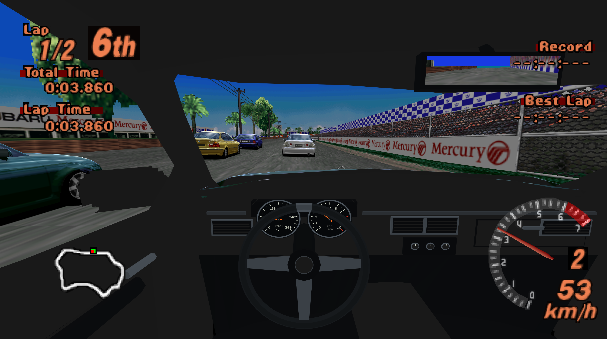

# Gran Turismo 2 PC, VR & Browser

A native C++ port with Arcade and Simulation, cockpit driving, desktop and VR
support. The browser compiles the same game code to WebAssembly and renders with
WebGL2. Gameplay fixes belong to the shared C++ code and reach each platform when
it is rebuilt.

**[Play the browser version](https://ydubr-gt2.surge.sh/)** — select your own BIN disc image to start.

**Download the current complete release: `GT2-0.8.1.zip`.** It contains the common
source, all platform installation/build scripts, precompiled Windows tools, a signed Quest APK, and a ready-to-deploy `web/`
folder. You do not need an older release for VR, macOS or Steam Deck.

| Platform | Start here | Where the game runs |
|---|---|---|
| Windows desktop | `INSTALL-PC.bat`, then `PLAY.bat` in the installed folder | Windows PC |
| Windows PCVR / OpenXR | `INSTALL-PCVR.bat`, then `PLAY-PCVR-META.bat`, `PLAY-PCVR-STEAMVR.bat` or `PLAY-PCVR-VD.bat` | PC with a connected headset |
| Quest standalone | `INSTALL-QUEST.bat`; see [Quest installation](docs/QUEST.md) | On the headset |
| macOS | `INSTALL-MACOS.command` | Mac, flat screen |
| Steam Deck / desktop Linux | `INSTALL-STEAMDECK.sh` | Linux, flat screen |
| Browser | Serve `web/`, open `index.html` over HTTP(S), select your BIN and press Start | Browser, flat screen |

Windows and Quest installers use the compiled files under `native/` and prepare
your local disc data. Mac and Steam Deck installers build from the included source.
The browser files are already compiled. This is one release with different
platform entry points. Native applications retain their platform-specific VR,
controller and graphics features; the browser runs in flat-screen mode.

Supply your own supported disc images. Game data, BIOS and saves are not included.
The screenshot above illustrates gameplay. Release history belongs in
[CHANGELOG.md](CHANGELOG.md); the feature list below describes the current project.

## Features

- A fitted cockpit for live single-player Driver view, with moving steering wheel and hands, speed/RPM needles, seat adjustments and a central rear-view mirror. Replays and split-screen retain their existing views. See [cockpit controls](docs/COCKPIT.md).
- Native PC/Quest startup and a saved disc preference. Arcade and Simulation share graphics, HUD and control preferences while keeping separate memory cards. Desktop settings include HD media, intro visibility, all HUD switches, a profiler, gamepad bindings, DualSense pedals and both Arcade/Simulation cheats.
- Windows PCVR through OpenXR, with theatre menus/movies, stereo races, tracked head movement and Touch controls. See [PCVR setup](docs/PCVR.md).
- USB save transfer in both directions between PC and Quest, with card validation, backups and verified copying. Desktop and PCVR share PC saves. See [save transfer](docs/SAVE-TRANSFER.md).
- Arcade and Simulation discs, with a startup disc picker on PC and Quest, shared preferences and separate saves for each mode.
- Arcade races, rally/time trials, opponent AI, ghost/replay sessions; Simulation career, licences, dealerships, garage, tuning and events.
- Original fixed-step vehicle simulation, animated steering/suspension/wheels, car reflections, track scenery, particles and night lighting.
- Native audio: engine, tyres, road effects, music and movies. Race pause stops timers and the entire race audio mixer. VR/system suspension does not advance the race.
- Disc publisher/warning screens and Arcade intro, course previews and ending movies; button skipping. Optional playback of a locally prepared PlayStation startup; BIOS and captured startup media are **not bundled or required to play**.
- Saved graphics and control settings, graphics overlay, configurable draw distance including the entire course and distant scenery, MSAA and texture filtering.
- Original-resolution assets with higher-resolution rendering. PC supports fixed **720p, 1080p, 1440p and 4K**, or 50–200% of window size; configurable FPS cap/VSync and interpolated presentation. Physics stays at 30 Hz.
- Keyboard, XInput controllers and **native DualSense / DualSense Edge support on PC**, over USB or Bluetooth: buttons, sticks, trigger pedals, adjustable vibration and adaptive accelerator/brake resistance. Adaptive effects do not require Steam Input. Touch controllers have vibration, not adaptive triggers.
- Quest theatre-screen menus/movies and head-tracked stereo driving/replays. The HUD is projected per eye; the cockpit mirror sits on a physical surface inside the cabin.
- Three VR driving modes on PCVR and Quest: **Stick, Virtual wheel and Motion**. One/two-handed wheel grabbing with animated hands; all fingers stay closed while holding the wheel. Motion uses wrist rotation around the forearm, with grip-held steering and independent trigger pedals.
- VR Controls submenu: driving bindings, selected steering stick/motion hand, wheel position/size and height-only adjustment of the original starting flythrough. Automatic brake-to-reverse is available.
- VR Graphics submenu: 50–200% eye resolution, available headset refresh rates, MSAA, distance, textures, foveation and vibration. Resolution changes require a restart; other supported settings apply immediately.
- Saved km/h / mph selection in the VR HUD menu, with km/h as the default on both discs. Saved HUD visibility controls for map, lap/times, records, gauges, turbo, tyres, mirror, countdown, warnings, messages and replay caption.
- FPS profiler: application FPS, frame time, GPU time, 1% low, peak frame interval, texture-cache coverage and frustum-culling counts.
- Arcade cheats: unlock all course selections and the car roster as reversible overrides. Simulation VR cheats: gold licences, 99,999,999 credits, event unlocks and a car catalogue for adding cars to the garage. The original 100-car garage limit remains. Career cheat writes are checked and backed up before replacing a save.
- VR performance features: multiview stereo, both-eye frustum culling, decoded texture caching, staged uploads, direct MSAA rendering to compatible XR images, fixed peripheral foveation and CPU/GPU performance requests.
- Trees use position-based cylindrical billboards in VR: head rotation alone does not rotate them.
- Developer tools for car/track export, JSON modifications, captures and reference comparisons. Arbitrary new-track geometry compilation is not implemented.

- Native macOS support through SDL2 and Vulkan/MoltenVK, with disc import and optional HD media preparation.
- Steam Deck / Linux support through SDL2 and Vulkan, with a graphical disc importer and Desktop Mode installer.
- Browser play through WebAssembly/WebGL2, local BIN selection, keyboard/gamepad input, audio, persistent saves and save backup import/export.
- Desktop render scale from 50% to 200% in 5% steps, plus fixed output resolutions.
- Automatic brake-to-reverse for keyboard and supported controller bindings: hold Down to stop and then reverse; Up brakes reverse motion before driving forward.

## Install and play

Extract the complete ZIP into a writable folder. Keep the source and scripts
together. Native installation may download build prerequisites; no game images
are downloaded. Existing data and saves are preserved by the normal update path.

- **Windows / PCVR:** run `INSTALL-PC.bat` or `INSTALL-PCVR.bat`. Open settings with F10. Select the PLAY launcher for your installed OpenXR runtime; see [PCVR setup](docs/PCVR.md).
- **Quest:** run `INSTALL-QUEST.bat`; see [Quest instructions](docs/QUEST.md). `INSTALL-LINUX.sh` is the separate Linux-to-Quest installer, not the Steam Deck desktop game installer.
- **macOS:** run `INSTALL-MACOS.command`, then the installed `GT2.app`. See [macOS setup](docs/MACOS.md).
- **Steam Deck:** switch to Desktop Mode, extract the ZIP, run `INSTALL-STEAMDECK.sh` and open the installed GT2 shortcut. See [Steam Deck setup](docs/STEAMDECK.md).
- **Browser:** run `python web/serve-web.py --directory web --port 8080`, then open `http://127.0.0.1:8080/`. For deployment, upload the contents of `web/` to a static HTTPS host. Keep `index.html`, `launcher.js`, `gt2.js` and `gt2.wasm` together; serve Wasm as `application/wasm`. Opening the HTML through `file://` does not work. See [browser build and hosting](docs/WEB.md).

Supported disc revisions and image requirements are listed in
[European disc support](docs/EUROPEAN-DISCS.md) and [player installation](docs/PLAYER-INSTALL.md).
Use complete 2352-byte-sector BIN/CUE images. The browser accepts a single full
BIN directly; native importers also support the formats documented for their
platform. A 2048-byte ISO omits XA audio/video sectors.

## Controls and saves

Menus use arrows/D-pad, Enter to select and Space to go back. Driving uses Up to
accelerate, Down to brake and reverse after stopping with automatic transmission,
Left/Right to steer, Space for the handbrake, C to change camera and Esc to pause.
Brake-to-reverse can be disabled in controls settings; manual transmission keeps
its explicit reverse binding. Desktop graphics settings offer 5% scale steps.
In the browser, Shift+Q opens settings without using the browser's F10 shortcut.

PCVR and Quest offer stick, virtual-wheel and motion steering. Open VR settings
with both stick clicks or both grips plus Menu. See [Quest controls](docs/QUEST.md),
[cockpit adjustments](docs/COCKPIT.md) and [wheel setup](docs/WHEELS.md).
Windows supports native DualSense controls and adaptive pedal resistance.
Physical wheels use the native Windows input backend; browser force feedback is
not available.

Native desktop/PCVR saves share the installed save directory. Use the supplied
transfer scripts for [PC/Quest save exchange](docs/SAVE-TRANSFER.md). Browser saves
use IndexedDB for the current site origin; Export saves creates a backup and
Import saves restores it before starting. Export before clearing browser data or
moving to a different address. Disc contents stay local and are never uploaded.

## Graphics and optional media

Cockpit seating and mirrors, draw distance, texture filtering, MSAA, HUD visibility
and the frame profiler are configurable. VR additionally offers eye resolution,
headset refresh selection and supported foveation. Higher settings increase GPU
load; use the profiler to choose settings appropriate for the device.

Native installers can prepare HD menus, fonts, HUD and movies from local game
assets. See [HD media](docs/HD-MEDIA.md). An optional locally supplied BIOS can
prepare the PlayStation startup sequence; a BIOS is not required for normal play.
No firmware or generated game artwork is distributed.

## Requirements and limits

Browser play requires WebGL2, an 8192-pixel texture limit and at least 512 array
texture layers. The complete BIN is held in memory. One disc is available per
page session; reload after graphics-context loss. Browser VR and physical-wheel
force feedback are not supported. See [browser setup](docs/WEB.md) and
[platform compatibility](docs/VALIDATION.md).

Cross-platform multiplayer and PSVR2 Sense adaptive triggers are planned for a
future release.

## Build from source

The release contains the same C++ source used by all targets. Platform adapters
handle windows, graphics APIs, devices and file storage.

```powershell
cmd /c build.cmd build_local
ctest --test-dir build_local --output-on-failure
./scripts/build-web.ps1 -Emsdk C:/path/to/emsdk
```

macOS uses `BUILD-MACOS.command`; Linux uses `BUILD-STEAMDECK.sh` or
`scripts/build-linux.sh`. Android instructions are in [QUEST.md](docs/QUEST.md).
Browser build instructions and the pinned toolchain are documented in [WEB.md](docs/WEB.md).
Run `scripts/audit-source.ps1 -FileSystem` before packaging a source snapshot.
Retail data, private research notes, credentials and build directories are excluded.

## License and credits

Project code is available under the [MIT License](LICENSE). Retain its copyright
and permission notice when redistributing. Credit: **Gran Turismo 2 PC & VR contributors**.
The license does not grant rights to game data, firmware, trademarks or extracted assets.

- **Khronos Group:** OpenXR headers/loaders, Apache-2.0; bundled JsonCpp retains its own license.
- **VRMADA / UltimateXR:** virtual hand meshes, poses and skin texture, MIT.
- **Sean Barrett and stb contributors:** image decoding/encoding, MIT.
- **Hyllian:** xBR contour processing, MIT.
- **Emscripten and SDL contributors:** browser toolchain and platform support; notices are included.
- **RetroArch team:** libretro API header for optional offline boot capture, MIT.

Optional offline media tools include Real-ESRGAN (BSD-3-Clause) and Beetle PSX
libretro (GPL-2.0); these are separate tools and are not linked into the game.
See [THIRD_PARTY.md](THIRD_PARTY.md) for full provenance and license locations.
